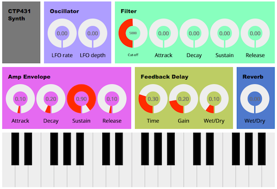

# Final project

CTP431 20150122 김민경

## Introduction #1 
A DJ is a person who mixes recorded music as it is playing.
They have their own 

## Procedures #2
We use two types of audio effect units, feedback delay and reverb, to enrich the synth sound. The delay unit is already implemented. Your job is adding the reverb based on convolution. Regarding the room impulse response, you should pick it up from [http://www.openairlib.net/](http://www.openairlib.net/). After choosing the impulse response file, ensure that the sampling rate is 44100 Hz/sec. Otherwise, resample it using Audition or Audacity. Referring to delay.js, implement the convolution reverb in reverb.js file. Note that you should rewire the units such that the delay is connected to the reverb, and the reverb is to the DAC. 

## Suggestion #3
Design your own synth sound by adjusting the parameters displayed on the GUI. Submit your code with the parameters. 

## Run it!

[https://mgkim9704.github.io/aaaa/](https://mgkim9704.github.io/aaaa/)

